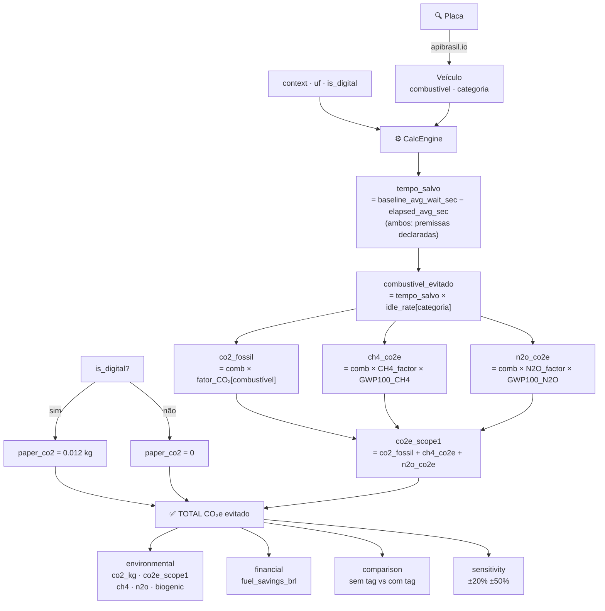

# EcoScore Calc Engine — Documentação Técnica

## 0. Fluxo de dados



---

## 1. O que o engine calcula

O `CalcEngine` estima as **emissões de GEE evitadas** quando um veículo utiliza uma tag de pagamento automático (pedágio/estacionamento) em vez do pagamento manual.

**Princípio:** com a tag, o veículo não precisa parar. O combustível que seria consumido na fila (marcha lenta + frenagem/aceleração) é economizado, e essa economia é convertida em CO₂e evitado.

```
Emissões evitadas = Emissões (cenário sem tag) − Emissões (cenário com tag)
```

---

## 2. Entradas

| Campo | Tipo | Descrição |
|---|---|---|
| `plate` | `str` | Placa do veículo (resolve automaticamente via apibrasil.io) |
| `elapsed_time` | `int (s)` | Tempo real da passagem com tag |
| `context` | `"pedagio" \| "estacionamento"` | Tipo de passagem |
| `uf` | `str (2 letras)` | Estado — usado para preço do combustível |
| `is_digital` | `bool` | Se a tag é digital (evita emissão de ticket de papel) |
| `vehicle.category` | `"leve" \| "pesado"` | Define a taxa de consumo em idle |
| `vehicle.fuel_type` | ver abaixo | Define o fator de emissão |

**`fuel_type` suportados:**
- `gasolina_c` — gasolina comercial (E30 blend, em vigor desde ago/2025)
- `diesel_s10` — diesel comercial (B15 blend, em vigor desde ago/2025)
- `diesel_s500` — diesel pré-2013 (sem blend)
- `etanol` — etanol hidratado (CO₂ biogênico)
- `gnv` — gás natural veicular (m³)
- `eletrico` — veículo elétrico (kWh, Escopo 2)

---

## 3. Fórmula central

```
tempo_salvo       = max(0, baseline_sem_tag − elapsed_time)

combustivel_saved = tempo_salvo × idle_rate[categoria]  [L, m³ ou kWh]

co2_fossil        = combustivel_saved × emission_factor[fuel_type]

ch4_co2e          = combustivel_saved × ch4_factor[fuel_type] × GWP100_CH4
n2o_co2e          = combustivel_saved × n2o_factor[fuel_type] × GWP100_N2O

co2e_scope1       = co2_fossil + ch4_co2e + n2o_co2e      # combustão direta
co2e_scope2       = combustivel_kWh × grid_factor_SIN      # somente EV

paper_co2_avoided = is_digital × co2_per_ticket            # ticket de papel evitado

TOTAL_CO2e        = co2e_scope1 + co2e_scope2 + paper_co2_avoided
```

**Para etanol:** `co2_fossil = 0` (CO₂ é biogênico — não conta no Escopo 1 do GHG Protocol).
O CO₂ biogênico é calculado e reportado separadamente como `co2_biogenic_kg`.

---

## 4. Fatores de emissão por combustível

Fonte: **FGV GHG Protocol Tool / BEN 2023 / MCTIC 2016**
Blend percentages: **ANP/CNPE** (E30 em vigor desde ago/2025; B15 em vigor desde ago/2025)

| Combustível | CO₂ fóssil (base) | Blend aplicado | CO₂ fóssil (comercial) | CH4 (kg/L) | N2O (kg/L) |
|---|---|---|---|---|---|
| Gasolina C | 2.239 kg/L | E30 (×0.70) | **1.567 kg/L** | 0.000406 | 0.000177 |
| Diesel S10 | 2.631 kg/L | B15 (×0.85) | **2.236 kg/L** | 0.000159 | 0.0000857 |
| Diesel S500 | 2.631 kg/L | sem blend | **2.662 kg/L** | 0.000185 | 0.0000995 |
| Etanol | 1.510 kg/L | — | **0 (biogênico)** | 0.000425 | 0.000130 |
| GNV | 1.999 kg/m³ | — | **1.999 kg/m³** | 0.0000184/m³ | 0.00000368/m³ |
| Elétrico | — | — | **0.046 kg/kWh** (SIN média 2023-2025) | — | — |

**GWP100 (IPCC AR6 2021, Tabela 7.SM.7):** CH4 = 27.9 | N2O = 273.0

---

## 5. Blend percentages — por que aplicado no DTO, não no engine

Os fatores de emissão são armazenados no banco como **base pura** (ex: diesel puro = 2.631 kg/L).
O `technical_specs_to_engine_dict()` em `dto/technical_specs.py` aplica o blend na conversão:

```python
diesel_co2 = emission_factor_diesel_s10 * (1.0 - blend_biodiesel_pct)
gasolina_co2 = emission_factor_gasolina_c * (1.0 - blend_etanol_pct)
```

Isso permite atualizar os percentuais de blend (quando ANP mudar a resolução) sem alterar o engine.

---

## 6. Taxas de idle (consumo em marcha lenta)

| Categoria | Taxa | Unidade | Fonte |
|---|---|---|---|
| Leve (gasolina/flex/etanol) | 0.00028 L/s (1.0 L/h) | L/s | U.S. DOE Fact #861 (2015) — proxy |
| Pesado (diesel) | 0.00069 L/s (2.5 L/h) | L/s | U.S. DOE Fact #861 (2015) — proxy |
| GNV | 0.00014 m³/s (0.50 m³/h) | m³/s | Estimativa por conversão energética |
| Elétrico | 0.00028 kWh/s (1.0 kWh/h) | kWh/s | Estimativa |

**Importante:** não existe dado público CETESB/INMETRO equivalente. Os valores atuais são proxy baseados em U.S. DOE. Para inventários GHG formais, recomenda-se validação com fabricantes ou medição de campo.

---

## 7. Tempos baseline (premissas declaradas)

| Contexto | Valor | Nota |
|---|---|---|
| Pedágio sem tag | 180 s | Estimativa: pagamento manual ~30-45s + fila |
| Estacionamento sem tag | 120 s | Estimativa: emissão de ticket + cancela |

**Sem dado público oficial.** ANTT, ABCR, CCR, Ecorodovias não publicam tempos médios por tipo de pista. Este é o parâmetro de **maior sensibilidade** do modelo — uma variação de ±50% no baseline altera o CO₂e evitado proporcionalmente.

---

## 8. Resultado — estrutura de saída

```python
{
  "environmental": {
    "co2_kg": float,              # total CO₂e evitado (backward compat)
    "co2_fossil_kg": float,       # só CO₂ de combustão fóssil
    "co2_biogenic_kg": float,     # CO₂ biogênico (etanol) — reportar separado
    "ch4_kg_co2e": float,         # CH4 em CO₂e
    "n2o_kg_co2e": float,         # N2O em CO₂e
    "co2e_scope1_kg": float,      # total Escopo 1 (combustão)
    "co2e_scope2_kg": float,      # Escopo 2 (EV, rede elétrica)
    "paper_co2_avoided_kg": float,# ticket de papel evitado (upstream)
    "fuel_amount": float,         # combustível economizado (L / m³ / kWh)
    "fuel_unit": str,             # "L" | "m3" | "kWh"
    "fuel_liters": float,         # backward compat (0 para GNV/EV)
    "water_liters": float,
    "paper_tickets": float,
  },
  "financial": {
    "fuel_savings_brl": float,
    "maintenance_savings_brl": float,
    "total_savings_brl": float,
  },
  "comparison": {
    "without_tag": { time_sec, fuel_amount, fuel_unit, co2e_scope1_kg, ... },
    "with_tag":    { ... },
    "delta":       { ... },
  },
  "sensitivity": {
    "base_co2e_kg": float,
    "parameters": [
      {
        "key": "baseline_wait_sec",
        "label": str,
        "note": str,          # aviso se parâmetro sem fonte oficial
        "base": float,        # valor base
        "low_50pct": float,   # co2e com −50%
        "low_20pct": float,
        "high_20pct": float,
        "high_50pct": float,
      },
      ...
    ]
  },
  "metadata": { time_saved_sec, baseline_wait_sec, context, is_digital, uf_passagem, pricing_snapshot },
  "storytelling": { legacy, by_axis },
}
```

---

## 9. Auditabilidade

Cada transação salva `parameters_snapshot` (JSONB) com:
- todos os inputs (plate, elapsed_time, vehicle, uf, context)
- fatores de emissão usados no momento do cálculo
- CH4/N2O factors e GWP100
- blend percentages aplicados
- resultado completo

Isso garante rastreabilidade: o cálculo pode ser replicado a partir do snapshot.

---

## 10. Limitações declaradas

| Parâmetro | Status | Ação recomendada |
|---|---|---|
| `idle_rate_leve/pesado` | Proxy U.S. DOE 2015 | Validar com CETESB ou fabricantes BR |
| `baseline_*_avg_wait_sec` | Premissa declarada | Medir com cronômetro em campo (50 amostras) |
| `emission_factor_eletrico_kwh` | SIN média 2023-2025 = 0.046 kg/kWh (FGV Aba Fatores Variáveis) | Atualizar anualmente com FGV/ONS |
| Blend percentages | E30/B15 em vigor desde ago/2025 | Monitorar próximas resoluções ANP/CNPE |

---

## 11. Como atualizar fatores

Via API (requer autenticação admin):

```http
PATCH /api/technical-specs/
Content-Type: application/json

{
  "emission_factor_diesel_s10": 2.631,
  "blend_biodiesel_pct": 0.15,
  "blend_factors_source": "ANP/CNPE: B15 por Resolução CNPE ago/2025",
  "blend_factors_year": 2025
}
```

A API valida os valores e aplica o blend automaticamente no próximo cálculo.

---

## 12. Referências

| Fonte | URL | Uso |
|---|---|---|
| FGV GHG Protocol Tool | https://bibliotecadigital.fgv.br/dspace/handle/10438/30248 | Fatores CO₂, CH4, N2O por combustível |
| IPCC AR6 2021 | https://www.ipcc.ch/report/ar6/wg1/ | GWP100: CH4=27.9, N2O=273.0 |
| ANP Lei 14.993/2024 | https://www.anp.gov.br | Blend gasolina: E27 → E30 (em vigor desde ago/2025) |
| CNPE Resolução 2024 | https://www.gov.br/mdic | Blend diesel: B14 → B15 (em vigor desde ago/2025) |
| U.S. DOE Fact #861 | https://www.energy.gov/eere/vehicles/fact-861 | Idle rate proxy |
| apibrasil.io | https://apibrasil.io | Plate lookup → fuel_type, category, FIPE value (requer APIBRASIL_TOKEN) |
| ONS/FGV 2023-2025 | Aba "Fatores Variáveis" GHG Protocol Tool | Fator SIN elétrico |
