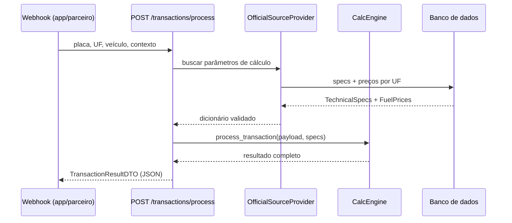

# Engine de Cálculo

A engine é o cérebro do sistema. Cada vez que um usuário passa por um pedágio ou estacionamento com a tag, ela calcula quanto CO₂, água e papel foram evitados, quanto dinheiro foi economizado, e transforma tudo isso em métricas fáceis de entender — como "você salvou X árvores" ou "economizou Y cafezinhos".

Pense nela como uma calculadora de impacto ambiental: recebe os dados da passagem (placa, estado, tipo de veículo), busca as referências oficiais (preços de combustível, fatores de emissão) e devolve um pacote completo de informações para o app e os relatórios ESG.

---

## Fluxo principal

---

## Módulos

| Arquivo | Classe / Função | Responsabilidade |
|---|---|---|
| `engine/calc_engine.py` | `CalcEngine` | Todos os cálculos ambientais e financeiros |
| `engine/orchestrator.py` | `TransactionOrchestrator` | Recebe o evento da tag e aciona a engine |
| `engine/spec_validation.py` | `validate_engine_specs()` | Garante que os parâmetros estão completos e válidos antes de calcular |
| `engine/exceptions.py` | `CalcEngineError` | Erro específico da engine (herda `ValueError`) |
| `providers/official_source_provider.py` | `OfficialSourceProvider` | Busca e sincroniza dados oficiais (ANP/BigQuery) |

---

## CalcEngine — métodos

| Método | O que faz |
|---|---|
| `convert_to_co2(unit, value)` | Converte qualquer unidade (km, litros…) para kg de CO₂e |
| `convert_from_co2(unit, value)` | Converte kg de CO₂e para outra unidade (ex: km percorridos equivalentes) |
| `calculate_emissions_from_fuel(fuel_type, liters)` | Calcula emissões de CO₂e a partir do tipo de combustível e volume queimado |
| `calculate_avoided_idle_fuel(category, uf)` | Combustível economizado por não ficar parado em fila de pedágio |
| `calculate_avoided_acceleration_fuel(category)` | Combustível economizado por não frear e acelerar na cancela |
| `calculate_paper_and_water_savings(is_digital)` | Impacto evitado por usar ticket digital (papel e água poupados) |
| `resolve_fuel_price_brl_per_liter(fuel_type, uf)` | Retorna o preço do litro de combustível para o estado da passagem |
| `calculate_financial_savings(category, fuel_type, uf)` | Calcula a economia em R$ por passagem (combustível + manutenção) |
| `build_comparison(category, fuel_type, uf, is_digital)` | Monta o cenário "com tag" vs "sem tag" para exibir no dashboard |
| `get_ludic_metrics(co2_kg, water_l, paper_g)` | Transforma os números em métricas gamificadas (árvores, cafés, carregamentos de celular) |
| `get_ludic_metrics_by_axis(co2_kg, water_l, paper_g)` | Mesmo que acima, organizado por eixo: carbono / água / papel |
| `calculate_payback_snapshot(accumulated, monthly_fee, billing_months)` | Calcula em quantos meses a tag "se paga" com as economias acumuladas |
| `process_transaction(payload, specs)` | **Método principal** — orquestra todos os cálculos e monta o JSON de resposta |

---

## OfficialSourceProvider

Responsável por manter os parâmetros de cálculo sempre atualizados com dados oficiais.

- `sync_all_sources()` — aciona a sincronização do BigQuery com preços de combustível ANP por UF (execução agendada, não por passagem)
- `get_specs_for_calc_engine()` — retorna o dicionário completo de parâmetros para o `CalcEngine`
- `get_fuel_price_by_uf_dict(uf)` — retorna preços de um estado específico

---

## Dados de entrada

Payload do webhook (`ProcessTransactionBody`):

| Campo | Tipo | Descrição |
|---|---|---|
| `plate` | string | Placa do veículo |
| `uf` | string | Estado da passagem (ex: `SP`, `RJ`) |
| `context` | enum | `pedagio` ou `estacionamento` |
| `vehicle.category` | enum | `leve` (carro) ou `pesado` (caminhão) |
| `vehicle.fuel_type` | string | Tipo de combustível |
| `vehicle.model` | string | Modelo do veículo |
| `timestamp` | datetime | Momento da passagem |
| `stops_avoided` | int | Paradas evitadas pela tag |
| `is_digital` | bool | Se o ticket foi digital (sem papel) |
| `payback` | objeto (opcional) | Dados para cálculo de retorno da tag |

---

## Dados de saída

Resposta (`TransactionResultDTO`) com 6 seções:

| Seção | Conteúdo |
|---|---|
| `environmental` | CO₂e evitado (kg), litros de combustível, água (L), papel (g) |
| `financial` | Economia em R$ (combustível e manutenção) |
| `comparison` | Cenário "com tag" vs "sem tag" lado a lado |
| `storytelling` | Métricas lúdicas por eixo (carbono, água, papel) |
| `metadata` | Snapshot de preços usados, UF aplicada, contexto |
| `payback` *(opcional)* | Status do retorno do investimento na tag |

---

## Fontes de dados oficiais

| Dado | Fonte | Como chega |
|---|---|---|
| Preços de combustível por UF | ANP via BigQuery (`basedosdados.br_anp_precos_combustiveis`) | Sync agendado → banco local |
| Fatores de emissão GHG | Estáticos no banco (sync via Climatiq pendente) | Configurados manualmente |

---

## Checklist de status

### ✅ Feito

- `CalcEngine` completo — 13 métodos cobrindo emissões, idle, aceleração, papel/água, financeiro, comparação, lúdico e payback
- `OfficialSourceProvider` com sync BigQuery de preços ANP por UF
- Persistência de `TechnicalSpecs` no banco com DTOs completos
- Validação estrita do dicionário de specs (`spec_validation.py`)
- Endpoint `POST /transactions/process`
- Endpoint `GET /technical-specs/`
- `TransactionOrchestrator` conecta webhook → engine

### 🔲 Pendente

- **Climatiq API** — buscar fatores de emissão reais e atualizados via [Climatiq](https://www.climatiq.io/); `OfficialSourceProvider` faz o sync, `CalcEngine` mantém conversões e orquestração
- **Senatran/Serpro** — lookup de veículo por placa; hoje os dados do veículo vêm no payload
- **GNV, elétrico, híbrido** — fatores de emissão ainda não mapeados
- **Sync de fatores GHG via MCTI** — hoje valores são estáticos no banco
- **Modelo multi-parada** — `accel_surge` fixo em 1 parada por passagem; revisar com dados reais
- **Eco-estimate de rota** — endpoint para estimar emissões antes da viagem (US08)
- **Meta semanal de impacto** — endpoint de progresso semanal (US10)
