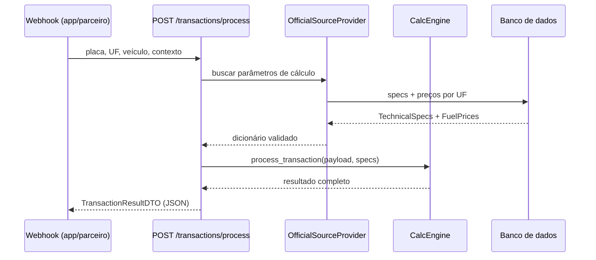

# Engine de Cálculo

A engine é o cérebro do sistema. Cada vez que um usuário passa por um pedágio ou estacionamento com a tag, ela calcula quanto CO₂, água e papel foram evitados, quanto dinheiro foi economizado, e transforma tudo isso em métricas fáceis de entender — como "você salvou X árvores" ou "economizou Y cafezinhos".

Pense nela como uma calculadora de impacto ambiental: recebe os dados da passagem (placa, estado, tipo de veículo), busca as referências oficiais (preços de combustível, fatores de emissão) e devolve um pacote completo de informações para o app e os relatórios ESG.

**Fórmulas, fatores GHG, blends e premissas:** [engine-calculo.md](engine-calculo.md)

---

## Fluxo principal

---

## Módulos

| Arquivo | Classe / Função | Responsabilidade |
|---|---|---|
| `engine/calc_engine.py` | `CalcEngine` | Todos os cálculos ambientais e financeiros |
| `engine/orchestrator.py` | `TransactionOrchestrator` | Recebe o evento da tag e aciona a engine |
| `engine/spec_validation.py` | `validate_engine_specs()` | Garante que os parâmetros estão completos e válidos antes de calcular |
| `engine/exceptions.py` | `CalcEngineError` | Erro específico da engine (herda `ValueError`) |
| `providers/official_source_provider.py` | `OfficialSourceProvider` | Busca e sincroniza dados oficiais (ANP/BigQuery) |
| `services/vehicle_lookup_service.py` | `lookup_vehicle_by_plate()` | Resolve placa → combustível/categoria via apibrasil.io |

---

## CalcEngine — métodos

| Método | O que faz |
|---|---|
| `calculate_co2e_from_fuel(amount, fuel_type)` | Breakdown CO₂e: fóssil, biogênico, CH4/N2O, Escopo 1 e 2 |
| `calculate_emissions_from_fuel(liters, fuel_type)` | Wrapper legado — retorna só `co2e_total_kg` |
| `calculate_avoided_idle_fuel(time_saved_sec, category, fuel_type)` | Combustível economizado por não ficar parado em fila |
| `calculate_paper_and_water_savings(is_digital, context)` | Impacto evitado por ticket digital (papel e água) |
| `resolve_fuel_price_brl_per_liter(uf, fuel_type)` | Preço do combustível para o estado da passagem |
| `calculate_financial_savings(fuel_saved, fuel_type, category, price)` | Economia em R$ por passagem (combustível + manutenção) |
| `build_comparison(...)` | Cenário "com tag" vs "sem tag" para o dashboard |
| `calculate_sensitivity(...)` | Variação de CO₂e com ±20% e ±50% nos parâmetros-chave |
| `get_ludic_metrics(co2_kg)` | Árvores equivalentes por CO₂ evitado |
| `get_ludic_metrics_by_axis(co2_kg, water_l, paper_tickets)` | Metáforas por eixo (carbono, água, papel) |
| `calculate_payback_snapshot(accumulated, monthly_fee, billing_months)` | Meses para a tag "se pagar" com economias acumuladas |
| `process_transaction(vehicle_data, context, uf, ...)` | **Método principal** — orquestra todos os cálculos |
| `convert_to_co2` / `convert_from_co2` | Conversões legadas para unidades lúdicas |

---

## OfficialSourceProvider

Responsável por manter os parâmetros de cálculo sempre atualizados com dados oficiais.

- `sync_all_sources()` — aciona a sincronização do BigQuery com preços de combustível ANP por UF (execução agendada, não por passagem)
- `get_specs_for_calc_engine()` — retorna o dicionário completo de parâmetros para o `CalcEngine`
- `get_fuel_price_by_uf_dict(uf)` — retorna preços de um estado específico

---

## Dados de entrada

Payload do webhook (`ProcessTransactionBody`):

| Campo | Tipo | Descrição |
|---|---|---|
| `plate` | string | Placa do veículo (lookup via apibrasil.io se veículo omitido) |
| `uf` | string | Estado da passagem (ex: `SP`, `RJ`) |
| `context` | enum | `pedagio` ou `estacionamento` |
| `vehicle.category` | enum | `leve` (carro) ou `pesado` (caminhão) |
| `vehicle.fuel_type` | string | Tipo de combustível |
| `vehicle.model` | string | Modelo do veículo |
| `timestamp` | datetime | Momento da passagem |
| `is_digital` | bool | Se o ticket foi digital (sem papel) |
| `payback` | objeto (opcional) | Dados para cálculo de retorno da tag |

Tempos de espera (baseline e com tag) vêm de `TechnicalSpecs`, não do payload — ver [engine-calculo.md §7](engine-calculo.md#7-tempos-baseline-premissas-declaradas).

---

## Dados de saída

Resposta (`TransactionResultDTO`) com 7 seções:

| Seção | Conteúdo |
|---|---|
| `environmental` | CO₂e evitado (kg), Escopo 1/2, CH4/N2O, combustível (L/m³/kWh), água, papel |
| `financial` | Economia em R$ (combustível e manutenção) |
| `comparison` | Cenário "com tag" vs "sem tag" lado a lado |
| `sensitivity` | Impacto de ±20% e ±50% em parâmetros-chave |
| `storytelling` | Métricas lúdicas por eixo (carbono, água, papel) |
| `metadata` | Snapshot de preços, UF, contexto, tempos |
| `payback` *(opcional)* | Status do retorno do investimento na tag |

Detalhes do JSON: [engine-calculo.md §8](engine-calculo.md#8-resultado--estrutura-de-saída).

---

## Fontes de dados oficiais

| Dado | Fonte | Como chega |
|---|---|---|
| Preços de combustível por UF | ANP via BigQuery (`basedosdados.br_anp_precos_combustiveis`) | Sync agendado → banco local |
| Fatores de emissão GHG | FGV GHG Protocol Tool (valores no banco) | Seed/admin via `TechnicalSpecs` |
| Dados do veículo por placa | apibrasil.io (DETRAN + FIPE) | `APIBRASIL_TOKEN` em runtime |

---

## Checklist de status

### ✅ Feito

- `CalcEngine` com breakdown GHG (CO₂ fóssil/biogênico, CH4, N2O, Escopo 1/2)
- Combustíveis: gasolina C, diesel S10/S500, etanol, GNV e elétrico
- Blends E30/B15 aplicados no DTO (`technical_specs_to_engine_dict`)
- Análise de sensibilidade (±20% / ±50%)
- `OfficialSourceProvider` com sync BigQuery de preços ANP por UF
- Lookup de placa via apibrasil.io (`vehicle_lookup_service`)
- Persistência de `TechnicalSpecs` no banco com DTOs completos
- Validação estrita do dicionário de specs (`spec_validation.py`)
- Endpoint `POST /transactions/process`
- Endpoint `GET /technical-specs/` e `PATCH` para admin
- `TransactionOrchestrator` conecta webhook → engine
- Snapshot de auditoria por transação (`parameters_snapshot`)

### 🔲 Pendente

- **Climatiq API** — sync automático de fatores de emissão via [Climatiq](https://www.climatiq.io/)
- **Híbrido** — `fuel_type` ainda não mapeado
- **Modelo multi-parada** — surge de aceleração fixo em 1 parada por passagem; revisar com dados reais
- **Eco-estimate de rota** — endpoint para estimar emissões antes da viagem (US08)
- **Meta semanal de impacto** — endpoint de progresso semanal (US10)
